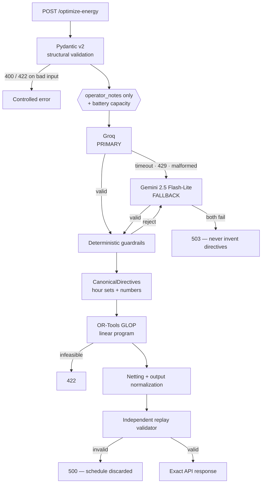

# GridWise — LLM-Assisted Smart Campus Energy Optimization

BUP CSE Fest 2026 Hackathon · Online Preliminary · Smart Campus Energy Optimization Challenge

A single stateless HTTP service that reads natural-language campus operator notes, converts them
into machine-checkable directives with a language model, validates those directives with
deterministic guardrails, solves the 24-hour scheduling problem with OR-Tools, and independently
replays the result before returning it.

**The central design point:**

| Component | Responsibility | What it is *not* allowed to do |
|---|---|---|
| **LLM** (Groq → Gemini) | Language understanding only — turn each operator note into one structured directive | Never computes a schedule, battery state, cost, or any scenario number |
| **Deterministic guardrails** | Reject untrusted model output that breaks any rule | Never repairs, guesses at, or "fixes up" a malformed directive |
| **OR-Tools** | All mathematical reasoning: the actual cost-minimizing 24-hour schedule | Never sees the operator notes, only canonical numbers |
| **Replay validator** | Independently re-derive and verify the finished schedule | Shares no computation with the optimizer |

---

## Table of contents

1. [Problem understanding](#1-problem-understanding) · 2. [Solution overview](#2-solution-overview) ·
3. [Architecture](#3-architecture) · 4. [End-to-end flow](#4-end-to-end-flow) ·
5. [API specification](#5-api-specification) · 6. [LLM directive interpretation](#6-llm-directive-interpretation) ·
7. [Groq primary model](#7-groq-primary-model) · 8. [Gemini fallback](#8-gemini-fallback) ·
9. [Deterministic guardrails](#9-deterministic-guardrails) · 10. [OR-Tools optimization](#10-or-tools-optimization) ·
11. [Energy balance](#11-energy-balance) · 12. [Battery model](#12-battery-model) ·
13. [Directive application](#13-directive-application) · 14. [Replay validation](#14-replay-validation) ·
15. [Project structure](#15-project-structure) · 16. [Environment variables](#16-environment-variables) ·
17. [Local setup](#17-local-setup) · 18. [Running the service](#18-running-the-service) ·
19. [Running tests](#19-running-tests) · 20. [Public sample tests](#20-public-sample-tests) ·
21. [Docker](#21-docker) · 22. [Deployment](#22-deployment) · 23. [Performance](#23-performance) ·
24. [Security](#24-security) · 25. [Failure handling](#25-failure-handling) ·
26. [Limitations](#26-limitations) · 27. [Future improvements](#27-future-improvements) ·
28. [Dependencies and credits](#28-dependencies-and-credits)

---

## 1. Problem understanding

A campus buys grid electricity, generates rooftop solar, and operates a battery. Demand, solar
availability and tariff are given for the next 24 hours. Separately, operators send 1–3 short
natural-language notes describing temporary conditions affecting the same day.

The service must:

1. Interpret **every** note — exactly one `directive_interpretation` entry per note, in
   `note_index` order.
2. Map relevant notes onto one of five supported directive types; mark irrelevant notes `no_op`
   rather than inventing an energy rule.
3. Validate the interpreted directives before they reach the optimizer.
4. Produce a 24-hour schedule that is **valid first** — energy balance, battery bounds and
   transitions, rate limits, effective-solar bounds, end-of-day neutrality, and every applicable
   directive — and **cheap second**.

The scoring model makes the ordering explicit: a cheap schedule built on a misread or unapplied
directive scores zero for that case. Correctness therefore drives every design decision below.

Two semantics are easy to get backwards and are handled explicitly throughout:

- **Time windows are start-inclusive and end-exclusive.** "1 PM to 3 PM" → hours `[13, 14]`.
- **`factor` is the fraction of solar that remains, not the amount removed.** "an 80% reduction"
  → `factor = 0.2`.

## 2. Solution overview

The pipeline is deliberately short and has exactly one non-deterministic stage, which is fenced in
on both sides:

```
HTTP request
  → Pydantic v2 structural validation
  → LLM interprets operator_notes ONLY          ← the only non-deterministic step
  → deterministic guardrails (reject, never repair)
  → canonical directives (pure numbers and hour sets)
  → OR-Tools linear program
  → independent replay validation
  → exact API response
```

The optimizer and the replay validator have no dependency on the LLM at all. If the language model
is removed, the deterministic core still solves any scenario correctly — it simply has no
directives to apply. That is why the implementation order was: schemas → optimizer → replay
validator → guardrails → LLM.

## 3. Architecture



Key architectural properties:

- **Stateless.** No database, cache, queue or persistent storage. Any instance can serve any request.
- **The LLM cannot reach the optimizer directly.** The only type that crosses the boundary is
  `CanonicalDirectives`, a frozen dataclass of hour sets and floats. There is no code path by which
  model text becomes a constraint without passing through the guardrails.
- **Two independent checks of the same schedule.** The optimizer asserts constraints to the solver;
  the replay validator re-derives the whole schedule from scratch and checks the same rules again.

## 4. End-to-end flow

1. **Structural validation** (`app/schemas.py`). Exactly 24 hours covering 0–23 with no duplicates,
   1–3 non-empty notes, non-negative finite numbers, and a self-consistent battery. Unknown fields
   are rejected. Input is never silently modified; hours supplied out of order are sorted for
   processing but the response always carries hours 0–23 in order.
2. **Interpretation** (`app/llm/`). Only the notes and the battery capacity are sent to the model.
3. **Guardrails** (`app/guardrails/validator.py`). ~17 independent checks; any failure rejects the
   whole response and triggers the next provider attempt.
4. **Canonicalization**. Validated entries merge into one `CanonicalDirectives` bundle. Where
   several directives touch the same hour, the **strictest** value wins, so no directive can cancel
   another.
5. **Optimization** (`app/optimizer/`). A linear program over 120 continuous variables.
6. **Normalization** (`app/optimizer/solver.py`). Simultaneous charge/discharge is netted out, grid
   and battery trajectory are rebuilt so the balance holds by construction, and values are rounded
   once at the response boundary.
7. **Replay** (`app/validation/replay.py`). Everything is recomputed from the plan that is about to
   be returned. On any violation the schedule is discarded rather than returned.

## 5. API specification

### `GET /health`

```bash
curl -s http://localhost:8000/health
```
```json
{"status": "ok"}
```

### `POST /optimize-energy`

```bash
curl -s -X POST http://localhost:8000/optimize-energy \
  -H 'Content-Type: application/json' \
  -d '{
    "scenario_id": "GRID-101",
    "operator_notes": [
      "Solar output will drop to about 20% from 1 PM to 3 PM.",
      "Do not charge the battery between 2 PM and 4 PM.",
      "The cafeteria menu changes tomorrow."
    ],
    "hours": [
      {"hour": 0, "demand_kwh": 180, "solar_kwh": 0, "tariff_bdt_per_kwh": 7},
      "... 22 more entries ...",
      {"hour": 23, "demand_kwh": 200, "solar_kwh": 0, "tariff_bdt_per_kwh": 9}
    ],
    "battery": {
      "capacity_kwh": 500, "initial_energy_kwh": 200, "minimum_energy_kwh": 50,
      "max_charge_kwh_per_hour": 100, "max_discharge_kwh_per_hour": 100
    }
  }'
```

A complete, runnable request body is available in `samples/public_cases.json` (each `cases[i].input`).

**Response**

```json
{
  "scenario_id": "GRID-101",
  "directive_interpretation": [
    {"note_index": 0, "applies": true, "directive_type": "solar_reduction",
     "structured_adjustment": {"hours": [13, 14], "factor": 0.2},
     "explanation": "Usable solar falls to 20% during the stated window."},
    {"note_index": 1, "applies": true, "directive_type": "no_charge_window",
     "structured_adjustment": {"hours": [14, 15]},
     "explanation": "Battery charging is unavailable in this window."},
    {"note_index": 2, "applies": false, "directive_type": "no_op",
     "structured_adjustment": null,
     "explanation": "This note does not affect today's energy schedule."}
  ],
  "hourly_plan": [
    {"hour": 0, "grid_kwh": 180, "solar_used_kwh": 0,
     "battery_action": "idle", "battery_kwh": 0, "battery_energy_after_kwh": 200}
  ],
  "total_grid_kwh": 0,
  "total_cost_bdt": 0,
  "peak_grid_kwh": 0,
  "plan_summary": "Applied directives: ..."
}
```

**Status codes**

| Code | Meaning |
|---|---|
| `200` | Successful health or optimization response |
| `400` | Malformed JSON body |
| `422` | Well-formed but semantically invalid request, or no feasible schedule exists |
| `500` | Controlled internal error, or the schedule failed replay validation and was discarded |
| `503` | Every LLM provider failed — no directives are invented and no schedule is returned |

Errors return `{"detail": "..."}` with no stack trace and no configuration values.

## 6. LLM directive interpretation

The model is mandatory and sits directly in the path that produces the optimizer's constraints. It
is given one job: turn each note into one structured directive.

**What is sent** — the operator notes, and `battery_capacity_kwh`. Nothing else.

The capacity scalar is required because operators express reserves as a percentage of capacity
("keep at least 50% of the battery capacity in reserve"), which cannot be resolved into an absolute
kWh figure without it. Demand, solar and tariff series are never sent: the model has no use for them
and they would only add latency and hallucination surface.

**What comes back** — strictly this shape, and nothing else:

```json
{"interpretations": [
  {"note_index": 0, "applies": true, "directive_type": "no_charge_window",
   "structured_adjustment": {"hours": [14, 15]}, "explanation": "..."}
]}
```

**Supported directive types** (the only ones accepted):

| `directive_type` | `structured_adjustment` | Effect |
|---|---|---|
| `solar_reduction` | `{"hours": [...], "factor": n}` | `effective_solar[h] = solar[h] * factor` |
| `minimum_battery_reserve` | `{"hours": [...], "minimum_energy_kwh": n}` | `E_after[h] >= max(base_min, n)` |
| `no_charge_window` | `{"hours": [...]}` | `charge[h] = 0` |
| `no_discharge_window` | `{"hours": [...]}` | `discharge[h] = 0` |
| `max_grid_window` | `{"hours": [...], "max_grid_kwh": n}` | `grid[h] <= n` |
| `no_op` | `null` | No change to the model |

The system prompt (`app/llm/prompts.py`) emphasizes, with worked examples: start-inclusive /
end-exclusive windows; `factor` as the *remaining* fraction; one interpretation per note in order;
`no_op` for anything that does not change today's electricity schedule; percentage-of-capacity
reserve conversion; and an explicit instruction never to invent scenario data or directive types.

Paraphrase robustness comes from the model plus a synonym section in the prompt, **not** from phrase
matching. No public sample phrase, scenario id or number appears anywhere in `app/`.

## 7. Groq primary model

Groq is the primary provider, chosen for its low inference latency, which is what makes the p95 ≤ 5s
target comfortable.

- Model is read from `GROQ_MODEL` — nothing is tied to a single hard-coded model name. The default
  is `llama-3.3-70b-versatile`; any Groq chat model with JSON-object output works.
- `temperature=0`, `top_p=1` for maximum determinism.
- `response_format={"type": "json_object"}` for structured output.
- Request timeout from `GROQ_TIMEOUT_S` (default 8s); SDK-level retries are disabled so that
  retry policy lives in one place, the interpreter.
- Up to `GROQ_MAX_ATTEMPTS` attempts (default 2: the initial call plus one controlled retry).

## 8. Gemini fallback

`gemini-2.5-flash-lite` is the fallback, used only when Groq fails: timeout, connection failure,
rate limit (429), any other provider error, or output that fails the guardrails after the retry.

- One attempt only. There is no endless retry loop.
- `response_mime_type="application/json"`, `temperature=0`, timeout from `GEMINI_TIMEOUT_S`.
- Supports both the current `google-genai` SDK and the legacy `google-generativeai` package, so a
  deployment environment with either installed works.

If both providers fail the service returns `503`. It never fabricates directives and never returns
a schedule built on guesswork.

## 9. Deterministic guardrails

`app/guardrails/validator.py` treats model output as hostile. It runs **independently of Pydantic**
and rejects — it never repairs, because a silently repaired directive is indistinguishable from an
invented one.

Checks performed:

| # | Check | # | Check |
|---|---|---|---|
| 1 | Output is a list | 10 | Hours are unique |
| 2 | Exactly one entry per note | 11 | Hours are in ascending order |
| 3 | `note_index` is an integer in range | 12 | Hours list is non-empty |
| 4 | No duplicate `note_index` | 13 | Numeric values are finite (no NaN/Inf) |
| 5 | No missing `note_index` | 14 | `0 <= factor <= 1` |
| 6 | Entries are in ascending order | 15 | `minimum_energy_kwh >= 0` |
| 7 | `directive_type` is one of the six | 16 | `minimum_energy_kwh <= battery capacity` |
| 8 | `no_op` ⇒ `applies = false` **and** `structured_adjustment = null` | 17 | `max_grid_kwh >= 0` |
| 9 | Non-`no_op` ⇒ `applies = true` and the **exact** key set for that type | 18 | No key outside the required shape (so no invented parameters) |

A guardrail failure is treated exactly like a provider failure: the interpreter moves on to the next
attempt or the fallback provider.

**Merging.** `build_canonical_directives` combines validated entries. Where several directives cover
the same hour the strictest value wins — lowest `factor`, highest reserve, lowest grid cap, union of
no-charge and no-discharge hours — so multiple simultaneous directives all remain active and the
optimizer must satisfy their intersection.

## 10. OR-Tools optimization

A plain linear program solved with GLOP (`app/optimizer/model.py`). No binary variables, no
heuristics, no custom search.

**Decision variables**, per hour `h` (120 continuous variables total):

```
grid[h], solar_used[h], charge[h], discharge[h], battery_energy_after[h]   — all >= 0
```

**Objective** — the official one, and nothing else:

```
minimize  SUM over h of  grid[h] * tariff_bdt_per_kwh[h]
```

No battery-degradation term, carbon term, peak-shaving term or solar-preference term is added. Those
would change the optimum away from the one the judge computes.

**Variable bounds**

```
0 <= solar_used[h] <= effective_solar[h]
0 <= charge[h]     <= max_charge_kwh_per_hour      (0 in a no_charge_window)
0 <= discharge[h]  <= max_discharge_kwh_per_hour   (0 in a no_discharge_window)
0 <= grid[h]       <= max_grid_kwh                 (unbounded otherwise)
max(minimum_energy_kwh, directive_reserve[h]) <= battery_energy_after[h] <= capacity_kwh
```

Because directives are expressed as **bounds and linear constraints** rather than post-processing,
the solver optimizes within the feasible region rather than being corrected afterwards.

**Avoiding simultaneous charge and discharge.** A binary on/off variable per hour would turn this
into a MIP for no benefit: with no round-trip losses, charging and discharging in the same hour is
never profitable, only degenerate. The LP is kept pure and the degenerate case is removed
deterministically afterwards by netting `net = charge − discharge`. Netting provably preserves both
the energy balance (which depends only on `charge − discharge`) and the battery trajectory, and can
only *reduce* the magnitude against the rate limits. This gives physically valid schedules at LP
cost, which matters for the latency target.

## 11. Energy balance

For every hour, exactly:

```
grid_kwh[h] + solar_used_kwh[h] + battery_discharge_kwh[h]
    = demand_kwh[h] + battery_charge_kwh[h]
```

Asserted as an equality constraint in the LP, then rebuilt arithmetically during output
normalization (`grid = demand + net − solar_used`) so it holds by construction in the returned
numbers, then checked a third time by the replay validator. Surplus solar is curtailed; grid export
is not part of this challenge.

## 12. Battery model

```
h = 0 :  battery_energy_after[0] = initial_energy_kwh + charge[0] − discharge[0]
h > 0 :  battery_energy_after[h] = battery_energy_after[h−1] + charge[h] − discharge[h]
```

Bounds: `minimum_energy_kwh <= battery_energy_after[h] <= capacity_kwh`, raised for hours covered by
a `minimum_battery_reserve` directive. Rate limits are enforced per hour.

**End-of-day neutrality** is a hard equality constraint:

```
battery_energy_after[23] = initial_energy_kwh
```

The starting charge may shift energy between hours but can never be consumed as a free one-time
source.

`battery_action` semantics: `charge` and `discharge` both carry a non-negative magnitude in
`battery_kwh`, distinguished by the action; `idle` always has `battery_kwh = 0`.

## 13. Directive application

Applied deterministically **after** interpretation and **only** via `CanonicalDirectives`:

| Directive | Applied as |
|---|---|
| `solar_reduction` | Upper bound on `solar_used[h]` = `solar[h] * factor` |
| `minimum_battery_reserve` | Lower bound on `battery_energy_after[h]` = `max(base, directive)` |
| `no_charge_window` | Upper bound on `charge[h]` = 0 |
| `no_discharge_window` | Upper bound on `discharge[h]` = 0 |
| `max_grid_window` | Upper bound on `grid[h]` = `max_grid_kwh` |
| `no_op` | Nothing |

All applicable directives stay active simultaneously — the optimizer satisfies their intersection.
Overlapping directives of the same type resolve to the strictest value, so none can overwrite
another. Organizer scoring scenarios are stated to be feasible; infeasible combinations are still
handled safely with a `422` rather than a crash or an invalid schedule.

## 14. Replay validation

`app/validation/replay.py` is the last line of defence and deliberately shares no computation with
the optimizer. It takes the plan **as it will be returned** and re-derives everything:

1. 24 unique hours, 0–23 · 2. All values finite and non-negative · 3. `idle` ⇒ `battery_kwh = 0`
· 4. Effective solar recomputed from the base solar and the directives · 5. `solar_used <= effective_solar`
· 6. Energy balance every hour · 7. Charge rate limit · 8. Discharge rate limit
· 9. Battery transition replayed hour by hour · 10. `E_after >= max(base reserve, directive reserve)`
· 11. `E_after <= capacity` · 12. No charging in a no-charge window · 13. No discharging in a
no-discharge window · 14. Grid cap per hour · 15. End-of-day neutrality · 16. `total_grid_kwh`
recomputed · 17. `total_cost_bdt` recomputed · 18. `peak_grid_kwh` recomputed.

**If replay fails, the schedule is discarded and a `500` is returned.** An invalid schedule scores
zero for that case and risks the reliability score; a controlled error costs only that one case.

The tolerance used internally (`REPLAY_TOLERANCE`, default `1e-4`) is far tighter than the judge's
`0.01`, so the service fails before the judge would.

**Numeric precision.** Full precision is kept throughout the solver and normalization. Rounding
happens once, at the response boundary, to `OUTPUT_DECIMALS` (default 6) — tight enough to avoid
floating-point artifacts in the JSON, loose enough that no rounding can disturb a 0.01 tolerance.
Totals are computed from the **rounded** plan, so `total_grid_kwh`, `total_cost_bdt` and
`peak_grid_kwh` always agree exactly with `hourly_plan`, which the judge treats as the source of
truth. The final replay runs on the rounded values.

**`plan_summary`** is generated deterministically from the directives and the plan
(`build_plan_summary`). The LLM is never asked to write it — that would not satisfy the LLM
requirement anyway, and a generated summary could make claims the schedule does not support.

## 15. Project structure

```
app/
├── main.py                  FastAPI app, endpoints, controlled error handling
├── config.py                Environment-driven settings (no secret defaults)
├── schemas.py               Pydantic v2 models + CanonicalDirectives
├── llm/
│   ├── base.py              LLMProvider abstraction + JSON payload extraction
│   ├── groq_provider.py     Primary provider
│   ├── gemini_provider.py   Fallback provider (both SDK generations)
│   ├── prompts.py           System prompt + per-request prompt builder
│   └── interpreter.py       Provider orchestration, retry, fallback
├── guardrails/
│   └── validator.py         Deterministic validation + canonicalization
├── optimizer/
│   ├── model.py             OR-Tools LP construction and solve
│   └── solver.py            Netting, normalization, totals, plan summary
├── validation/
│   └── replay.py            Independent replay verification
└── utils/
    └── logging.py           Structured logging with secret redaction

tests/                       143 tests (see §19)
scripts/run_public_samples.py  Public-sample harness against a live service
samples/public_cases.json    The organizer's public sample pack
Dockerfile · .dockerignore · .env.example · requirements.txt · pytest.ini · .gitignore
```

## 16. Environment variables

No secret has a default. Copy `.env.example` to `.env` and fill it in.

| Variable | Required | Default | Purpose |
|---|---|---|---|
| `GROQ_API_KEY` | yes (primary) | — | Groq credential |
| `GROQ_MODEL` | no | `llama-3.3-70b-versatile` | Groq model id |
| `GROQ_TIMEOUT_S` | no | `8` | Per-request Groq timeout |
| `GROQ_MAX_ATTEMPTS` | no | `2` | Initial call + controlled retries |
| `GEMINI_API_KEY` | yes (fallback) | — | Gemini credential |
| `GEMINI_MODEL` | no | `gemini-2.5-flash-lite` | Gemini model id |
| `GEMINI_TIMEOUT_S` | no | `10` | Per-request Gemini timeout |
| `LLM_TEMPERATURE` | no | `0` | Determinism |
| `REPLAY_TOLERANCE` | no | `1e-4` | Internal validation tolerance |
| `OUTPUT_DECIMALS` | no | `6` | Response rounding |
| `LOG_LEVEL` | no | `INFO` | Log verbosity |
| `PORT` | no | `8000` | Bind port |

At least one provider key must be set. With both set you get the full primary/fallback path.

## 17. Local setup

From a clean environment:

```bash
git clone <repository-url>
cd gridwise

python3.12 -m venv .venv
source .venv/bin/activate          # Windows: .venv\Scripts\activate
pip install -r requirements.txt

cp .env.example .env
# edit .env and set GROQ_API_KEY and GEMINI_API_KEY
```

Requires Python 3.12.

## 18. Running the service

```bash
set -a && source .env && set +a        # load environment variables
uvicorn app.main:app --host 0.0.0.0 --port 8000
```

Verify:

```bash
curl -s http://localhost:8000/health
# {"status":"ok"}

curl -s -X POST http://localhost:8000/optimize-energy \
  -H 'Content-Type: application/json' \
  -d @<(python -c "import json;print(json.dumps(json.load(open('samples/public_cases.json'))['cases'][0]['input']))")
```

Interactive docs are at `http://localhost:8000/docs`.

## 19. Running tests

```bash
pytest                    # full suite
pytest -v                 # verbose
pytest tests/test_samples.py            # public sample regression only
pytest tests/test_property_based.py     # Hypothesis property tests only
```

Current state: **143 passed, 0 skipped** (no test requires network access or live LLM
credentials).

| File | Covers |
|---|---|
| `test_api.py` | Endpoints, exact response schema, 13 invalid-request cases, error safety |
| `test_schemas.py` | Pydantic validation, NaN/Inf rejection, battery consistency |
| `test_guardrails.py` | 28 rejection cases + every accepted shape + strictest-value merging |
| `test_optimizer.py` | Each directive alone, all five combined, determinism, infeasibility |
| `test_replay.py` | One deliberately corrupted schedule per rule the validator enforces |
| `test_llm_interpreter.py` | Payload parsing, retry/fallback orchestration, prompt content |
| `test_samples.py` | All 10 public cases, end-to-end through the HTTP API |
| `test_property_based.py` | Hypothesis-generated random feasible scenarios |

No test requires network access. Provider behaviour is exercised through stub providers injected via
`set_interpreter`, so timeouts, rate limits, malformed output and guardrail failures are all tested
deterministically. Prompt semantics — start-inclusive/end-exclusive windows, `factor` as the
*remaining* fraction, and `no_op` — are asserted directly in `test_llm_interpreter.py`, and hidden
paraphrases of the same directives are handled by the model plus the synonym guidance in the system
prompt rather than by phrase matching, which is why no public sample phrase appears anywhere in
`app/`. The end-to-end path against a real provider is exercised separately with
`scripts/run_public_samples.py`, which runs only against a deployed service.

## 20. Public sample tests

Two ways to run the ten public cases.

**Offline** (no service, no API keys — uses the published reference interpretation as the LLM
stand-in and checks the whole deterministic pipeline):

```bash
pytest tests/test_samples.py -v
```

**Against a running service** (exercises the real LLM path end to end):

```bash
python scripts/run_public_samples.py --base-url http://localhost:8000
```

Expected output:

```
PASS  /health -> {"status": "ok"}
PASS  SAMPLE-01  (1.12s)  cost=38365.00 reference=38365.00 quality_ratio=1.0000
...
10/10 cases passed | median 1.05s | p95 1.40s
```

The harness independently replays each returned schedule, checks every GridWise rule, compares the
reported directives against the published reference semantics, and reports the
`min(1, organizer_optimal / team_cost)` quality ratio.

**Result on the current implementation: all 10 public cases produce a valid schedule whose
recalculated cost equals the published reference optimum exactly (quality_ratio = 1.0000).**

Schedules are never compared byte-for-byte — equivalent optima are accepted, as the Problem
Statement specifies. `test_samples.py` also verifies the reverse direction: the organizer's own
reference schedules pass our replay validator, which confirms the validator is not over-strict.

## 21. Docker

**Build and run locally:**

```bash
docker build -t gridwise:1.0.0 .

docker run --rm -p 8000:8000 \
  -e GROQ_API_KEY="$GROQ_API_KEY" \
  -e GEMINI_API_KEY="$GEMINI_API_KEY" \
  -e GROQ_MODEL=llama-3.3-70b-versatile \
  -e GEMINI_MODEL=gemini-2.5-flash-lite \
  gridwise:1.0.0

curl -s http://localhost:8000/health   # {"status":"ok"}
```

**Fallback image** (fill in your registry reference before submitting):

```bash
docker pull <registry>/<namespace>/gridwise:1.0.0
docker run --rm -p 8000:8000 \
  -e GROQ_API_KEY=... -e GEMINI_API_KEY=... \
  <registry>/<namespace>/gridwise:1.0.0
```

| Property | Value |
|---|---|
| Base image | `python:3.12-slim` |
| Exposed port | `8000` (override with `PORT`) |
| Bind address | `0.0.0.0` |
| User | non-root (`gridwise`, uid 10001) |
| Secrets | **none baked in** — passed at run time with `-e` |
| Health check | built-in `HEALTHCHECK` against `/health` |
| Start command | `uvicorn app.main:app --host 0.0.0.0 --port ${PORT:-8000}` |

`.dockerignore` excludes `.env`, tests and caches, so no credential can reach the image.

## 22. Deployment

The service is a single stateless container with no database, queue or external dependency beyond
the LLM provider APIs, so it runs unchanged on any container platform.

Deployment requirements met:

- Both endpoints are publicly reachable over HTTP/HTTPS with **no** authentication, VPN, dashboard
  login or manual approval.
- Binds `0.0.0.0` on a configurable `PORT` (most platforms inject `PORT` automatically).
- `/health` is ready well inside 60 seconds of start — there is no model loading or warm-up.
- Secrets are supplied as platform environment variables, never committed and never in the image.
- Stateless, so horizontal scaling and restarts are safe.

Set `GROQ_API_KEY` and `GEMINI_API_KEY` in the platform's secret manager, deploy the image, and
confirm `GET /health` and one `POST /optimize-energy` **from outside** your development environment
before submitting.

## 23. Performance

Targets: p95 ≤ 5s, hard timeout 30s.

| Stage | Typical | Note |
|---|---|---|
| Pydantic validation | < 1 ms | |
| **LLM interpretation** | 0.3–1.5 s | The dominant cost; Groq is chosen for this reason |
| Guardrails | < 1 ms | Pure Python |
| OR-Tools solve | 3–10 ms | 120 variables, ~50 constraints |
| Normalization + replay | < 1 ms | |
| **Total** | **≈ 0.4–1.6 s** | Comfortably inside p95 ≤ 5s |

Design choices that keep latency down:

- Only the notes (plus one scalar) go to the model — a prompt of a few hundred tokens instead of a
  24-hour data series.
- Exactly **one** LLM call in the normal path. All notes are interpreted in a single request.
- `max_tokens=1024` caps the worst-case generation time.
- Groq timeout (8s) + one retry + Gemini timeout (10s) bounds the absolute worst case inside the
  30s limit.
- Provider clients are constructed once per process and reused, so no per-request connection setup.
- Blocking SDK calls run in a threadpool, so one slow request cannot block the event loop.
- LP rather than MIP — no branch-and-bound.
- No database, cache, queue or cold-start-heavy dependency.

## 24. Security

- **No secret is ever hard-coded or committed.** All credentials come from environment variables;
  `.env` is in both `.gitignore` and `.dockerignore`.
- **No secret in the image.** Keys are passed at run time.
- **No secret in logs.** `app/utils/logging.py` redacts any field whose name contains `key`,
  `token`, `secret`, `password` or `authorization`, and provider exceptions are logged by exception
  *type*, never by message, so an SDK cannot leak a key through an error string.
- **No secret or stack trace in responses.** Every error path returns a fixed, generic
  `{"detail": "..."}`. A catch-all handler converts any unexpected exception into a `500` with
  server-side logging only. A test asserts that error bodies contain no traceback or credential
  markers.
- **Non-root container user.**
- **Synthetic data only.** The service is stateless and stores nothing.

## 25. Failure handling

| Failure | Response |
|---|---|
| Malformed JSON | `400`, generic detail |
| Schema-invalid request | `422` with the offending field paths (values never echoed) |
| Groq timeout / 429 / connection error | Retry once, then fall back to Gemini |
| Groq output malformed or guardrail-rejected | Retry once, then fall back to Gemini |
| Gemini timeout / malformed / guardrail-rejected | Fail safely — `503` |
| Both providers unavailable | `503`. **No invented directives, no schedule.** |
| Solver infeasible | `422`, controlled message |
| Solver error | `500`, controlled message |
| **Replay validation fails** | `500` — the schedule is **discarded**, never returned |
| Unexpected exception | `500`, logged server-side, generic body |

The guiding rule: **never return a schedule that has not been independently verified, and never
invent a directive to paper over a provider failure.** Both would score zero on the affected case
while looking superficially successful.

## 26. Limitations

- **The LLM is a hard dependency.** If both providers are unreachable the service returns `503`
  rather than a schedule. This is deliberate — the challenge mandates LLM interpretation, and a
  phrase-matching fallback would be non-compliant — but it does mean provider availability caps the
  service's availability.
- **Interpretation is not deterministic across runs.** Temperature is 0 and the prompt is fixed, but
  an identical note can occasionally yield a different directive. Everything downstream of the
  guardrails *is* fully deterministic: the same canonical directives always produce the same
  schedule.
- **Battery capacity is sent to the model.** One scalar, needed to resolve percentage-of-capacity
  reserves into kWh. No demand, solar or tariff data is ever sent, and the guardrails still verify
  every returned number independently.
- **Ties between equally optimal schedules are arbitrary.** GLOP picks one optimal vertex. Cost is
  always optimal; the specific hourly actions and the resulting `peak_grid_kwh` may differ from the
  reference plan. The Problem Statement explicitly permits this.
- **No round-trip battery efficiency.** The Problem Statement defines lossless transitions, so none
  is modelled.
- **Only the six specified directive types are supported.** Anything else becomes `no_op`.
- **Single-day horizon only**; exactly 24 hours, no rolling window.
- **The Docker image has not been built in the authoring environment** (no Docker daemon available
  there). All pinned dependencies were verified to resolve on Python 3.12. Build it once locally
  before submitting.

## 27. Future improvements

- A small deterministic pre-parser for unambiguous time expressions, used only to *cross-check* the
  LLM's hours and trigger a retry on disagreement — raising interpretation accuracy without
  replacing the model.
- Self-consistency: two low-temperature interpretations, accepted only when the canonical directives
  agree.
- An in-process cache keyed on the note text, cutting repeat-note latency to near zero across a
  hidden test set that reuses phrasings.
- A third provider tier for redundancy beyond Groq and Gemini.
- Explicit modelling of round-trip efficiency and degradation cost, if a future round specifies them.
- Prometheus metrics for per-stage latency and provider fallback rate.

## 28. Dependencies and credits

| Dependency | Version | Purpose | Licence |
|---|---|---|---|
| [FastAPI](https://fastapi.tiangolo.com/) | 0.128.0 | HTTP framework | MIT |
| [Uvicorn](https://www.uvicorn.org/) | 0.28.0 | ASGI server | BSD-3 |
| [Pydantic](https://docs.pydantic.dev/) | 2.12.0 | Schema validation | MIT |
| [OR-Tools](https://developers.google.com/optimization) | 9.15.6755 | GLOP linear solver | Apache-2.0 |
| [groq](https://github.com/groq/groq-python) | 1.7.0 | Primary LLM SDK | Apache-2.0 |
| [google-genai](https://github.com/googleapis/python-genai) | 1.60.0 | Fallback LLM SDK (new SDK) | Apache-2.0 |
| [google-generativeai](https://github.com/google-gemini/generative-ai-python) | 0.8.6 | Fallback LLM SDK (legacy SDK) | Apache-2.0 |
| [pytest](https://pytest.org/) | 9.1.1 | Testing | MIT |
| [Hypothesis](https://hypothesis.readthedocs.io/) | 6.168.0 | Property-based testing | MPL-2.0 |
| [httpx](https://www.python-httpx.org/) | 0.28.1 | Test + harness HTTP client | BSD-3 |

**Models:** Groq (`llama-3.3-70b-versatile` by default, configurable) as primary;
Google `gemini-2.5-flash-lite` as fallback. Both are used solely for operator-note interpretation.

**Challenge materials:** Problem Statement, Participant Guide & Evaluation Rubric, and Public Sample
Cases provided by the Department of CSE, Bangladesh University of Professionals, in association with
Poridhi, for BUP CSE Fest 2026.

An AI coding assistant was used during development. The architecture, the LLM/guardrail/optimizer
separation, the optimization model and the validation strategy are the team's own design.